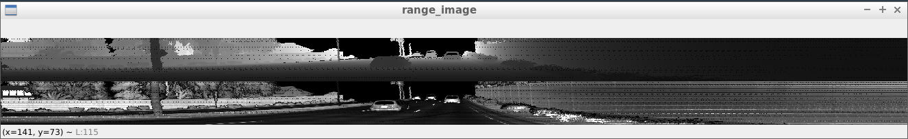
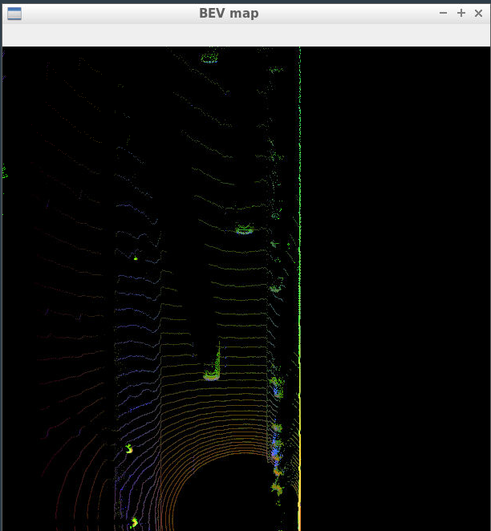
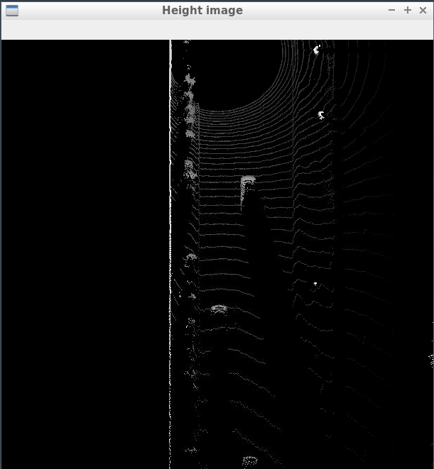
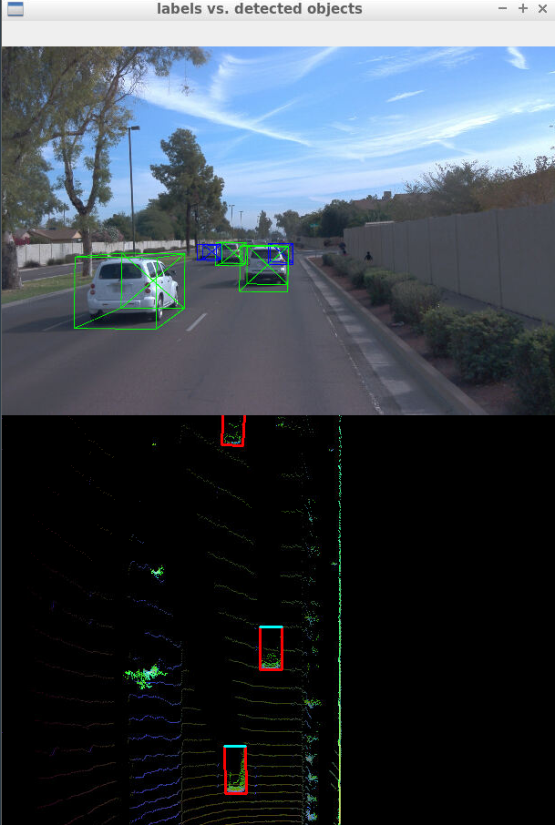
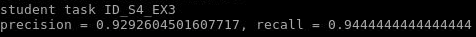
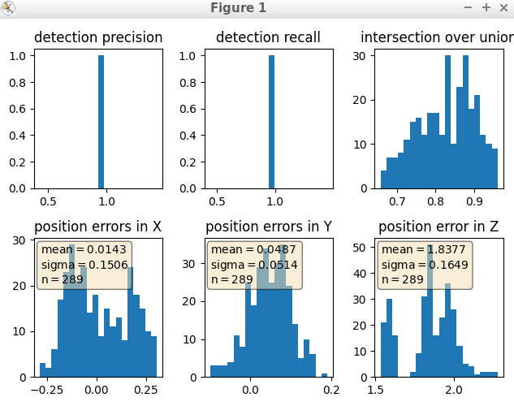
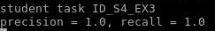
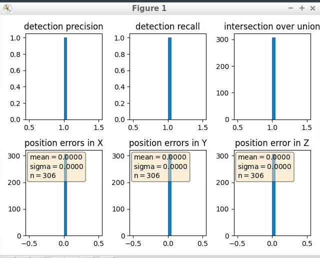

#  Sensor Fusion and Tracking - Object Detection

In this lesson, I get the ideas of how to process lidar point cloud data, and detect objects in BEV image.

## Section 1 : Compute Lidar Point-Cloud from Range Image
### Visualize range image channels (ID_S1_EX1)

### Visualize lidar point-cloud (ID_S1_EX2)

## Section 2 : Create Birds-Eye View from Lidar PCL
### Compute intensity layer of the BEV map (ID_S2_EX2) 

### Compute height layer of the BEV map (ID_S2_EX3)

## Section 3 : Model-based Object Detection in BEV Image

## Section 4 : Performance Evaluation for Object Detection
### DarkNet
Precision = 0.9292604501607717, Recall = 0.9444444444444444

### DarkNet
Precision = 1.0, Recall = 1.0

