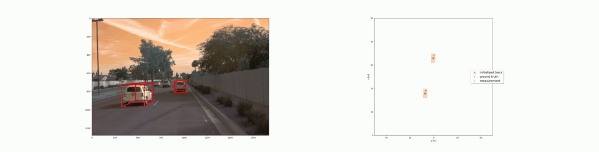
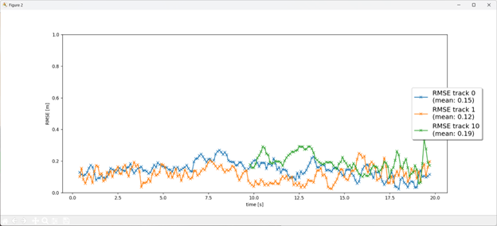

# Writeup: Track 3D-Objects Over Time

Please use this starter template to answer the following questions:

### 1. Write a short recap of the four tracking steps and what you implemented there (filter, track management, association, camera fusion). Which results did you achieve? Which part of the project was most difficult for you to complete, and why?
I implemented the tracking pipeline in four connected parts. 
- First, in `student/filter.py`, the `Filter` methods (`F()`, `Q()`, `predict()`, `update()`, `gamma()`, and `S()`) handle the EKF prediction and correction steps for a 3D constant-velocity model. 
- Second, in `student/trackmanagement.py`, `Track.__init__()` initializes new tracks from lidar measurements in vehicle coordinates, and `Trackmanagement.manage_tracks()`, `init_track()`, and `handle_updated_track()` manage score updates, state transitions, and deletion logic. 
- Third, in `student/association.py`, `Association.associate()`, `MHD()`, `gating()`, and `get_closest_track_and_meas()` perform gated nearest-neighbor matching, while `associate_and_update()` applies the matched measurements to each track. 
- Finally, in `student/measurements.py`, `Sensor.in_fov()`, `get_hx()`, `get_H()`, and `generate_measurement()`, together with camera setup in `Measurement`, enable camera-lidar fusion using the nonlinear camera measurement model.

With these pieces in place, tracks can persist across frames and be updated instead of being recreated every frame. The hardest part was getting track management stable when lidar and camera are processed sequentially in the same frame; small changes in score decay, gating, or deletion thresholds can easily make tracks disappear too early.

**Tracking visualization:**

**Tracking score progression:**

### 2. Do you see any benefits in camera-lidar fusion compared to lidar-only tracking (in theory and in your concrete results)?
Yes, there are clear benefits. Lidar is great for accurate distance and object shape, while camera adds rich visual context that lidar alone does not provide. In practice, this combination helps when one sensor is temporarily weak, like sparse lidar returns or noisy camera detections.

In my results, lidar was still the backbone for stable track initialization, but camera updates helped keep tracks alive and made the overall tracking behavior less brittle across frames.

### 3. Which challenges will a sensor fusion system face in real-life scenarios? Did you see any of these challenges in the project?
Real sensor fusion is sensitive to calibration, timing, occlusion, and noisy detections. If sensors are not perfectly aligned in space and time, track quality drops quickly. It is also hard to balance association: tight gates miss valid matches, but loose gates increase false matches (Badue et al., 2021).

I saw these issues in this project as well. The tracker was especially sensitive to parameter tuning, and small changes in gating or score/deletion settings could cause tracks to disappear too early.

### 4. Can you think of ways to improve your tracking results in the future?
I would focus on the following improvements:
- Use a stronger association strategy, as introduced in the lecture (for example, global assignment), to reduce wrong matches in crowded frames.
- Find a method to adaptively change tracking parameters based on environmental conditions.

### Reference
Badue, C., Guidolini, R., Carneiro, R. V., Azevedo, P., Cardoso, V. B., Forechi, A., Jesus, L., Berriel, R., Paixao, T. M., Mutz, F., Veronese, L., Oliveira-Santos, T. (2021). Self-driving cars: A survey. *Expert Systems with Applications*, 165, 113816.
