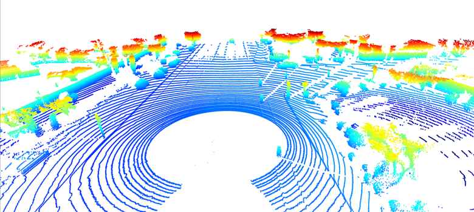
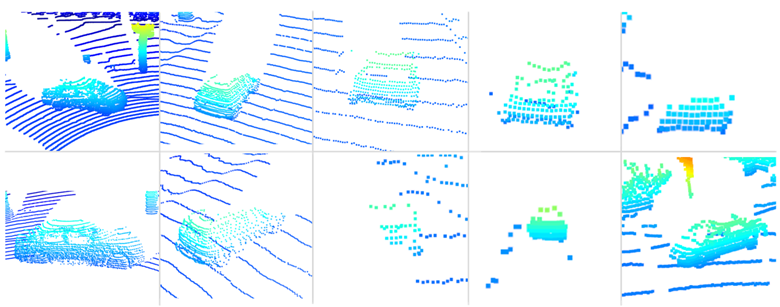
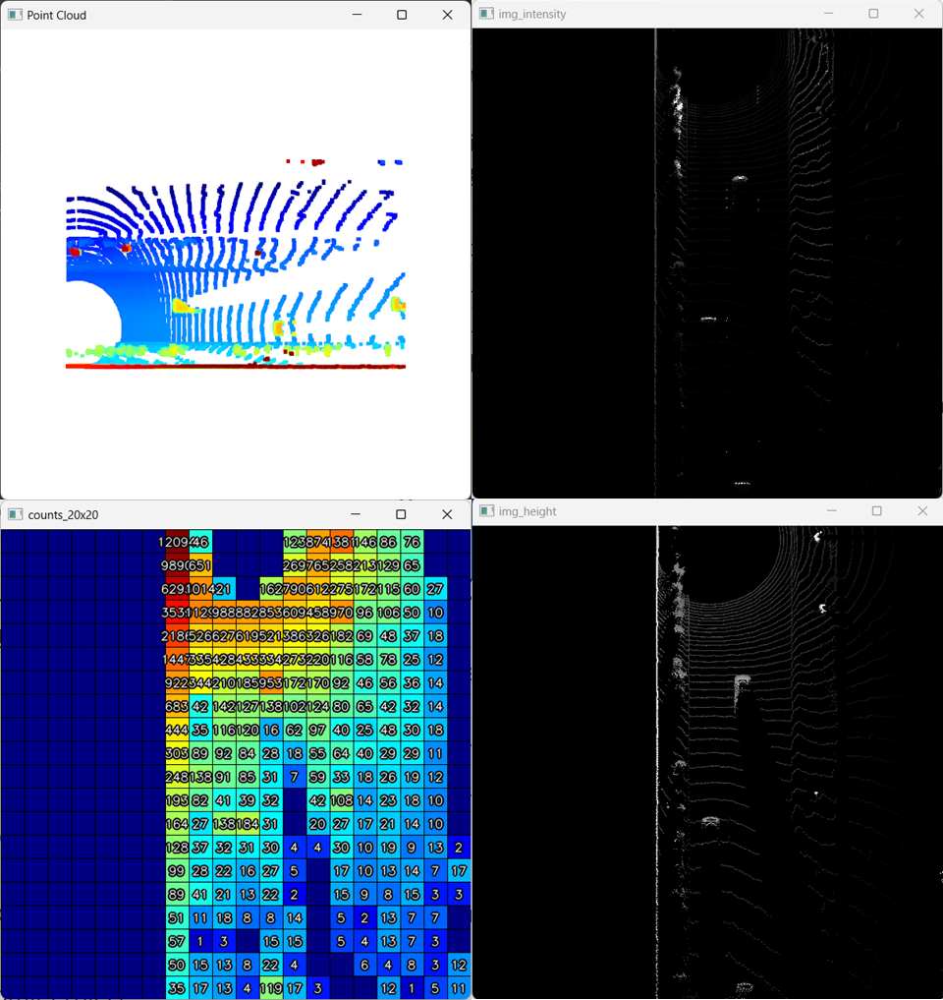
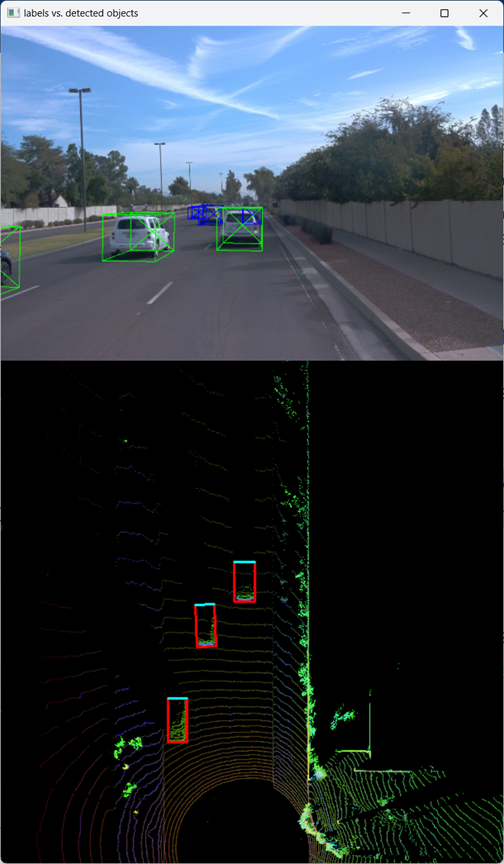
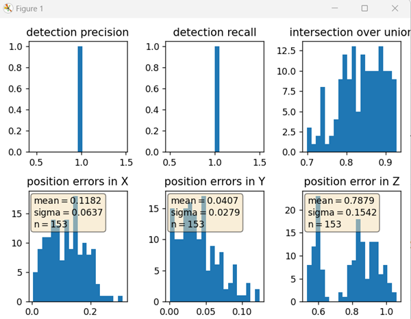

## Course 3 Sensor fusion - Midterm Project
- Udacity Self-Driving Car Engineer

For this midterm project in the Sensor Fusion course, the Waymo Open Dataset was used. 
Sensor data and calibration parameters were extracted from the dataset, 
and a LiDAR point cloud was constructed from the provided range images and visualized (ID_S1_EX2). 
The point cloud was then transformed into a Bird’s-Eye View (BEV) representation with ROI filtering/discretization 
and feature maps for intensity and height (ID_S2_EX1, ID_S2_EX2, ID_S2_EX3).

To understand the 3D object detection workflow, 
the inference pipeline of the [SFA3D model](https://github.com/maudzung/SFA3D) was reviewed, 
covering the full process of LiDAR → BEV → Model → Decode → Post-processing → Visualization → Evaluation.

Using the transformed BEV data—including LiDAR intensity, height, point density, and spatial (x, y) coordinates—
both FPN-ResNet and Darknet-based models were applied for object detection (ID_S3_EX1-3, ID_S3_EX1-4, ID_S3_EX1-5), 
and detections were converted into 3D bounding boxes (ID_S3_EX2).

FPN-ResNet, Darknet, and SFA3D represent three distinct design philosophies for 3D object detection using LiDAR data. 
- **FPN-ResNet** emphasizes detection accuracy by combining a deep ResNet backbone with a Feature Pyramid Network 
to fuse multi-scale features, making it particularly effective for detecting small or distant objects, 
albeit at the cost of higher computational complexity and lower inference speed. 
- **Darknet-based** models adopt a single-stage, YOLO-style architecture that prioritizes fast inference and simplicity, 
achieving real-time performance but with reduced robustness to scale variation and occlusion. 
- **SFA3D** further optimizes for speed by employing a lightweight, anchor-free, single-stage network 
operating on BEV representations of LiDAR point clouds, enabling very high frame rates while maintaining competitive accuracy 
for vehicle detection, though with limitations in detecting small or heavily occluded objects.

Detection performance metrics (IoU/center deviations and precision/recall per frame and in aggregate) were implemented 
and evaluated (ID_S4_EX1, ID_S4_EX2, ID_S4_EX3), and the results were visualized across 100 data frames.


## Compute Lidar Point-Cloud from Range Image

### Visualize range image channels (ID_S1_EX1)

**Requirements:**
- Convert range image “range” channel to 8bit
- Convert range image “intensity” channel to 8bit
- Crop range image to +/- 90 deg. left and right of the forward-facing x-axis
- Stack cropped range and intensity image vertically and visualize the result using OpenCV

```python
def show_range_image(frame, lidar_name):
    """
    Build an 8-bit visualization image by stacking range and intensity channels
    from the Waymo range image.

    Returns:
        img_range_intensity (np.ndarray): uint8 image of shape (2H, W)
    """

    ####### ID_S1_EX1 START #######
    #######
    print("student task ID_S1_EX1")

    # 1) Load range image: expected shape (H, W, C)
    ri = load_range_image(frame, lidar_name)
    if ri is None:
        raise ValueError(f"load_range_image returned None for lidar={lidar_name}")
    if ri.ndim != 3 or ri.shape[2] < 2:
        raise ValueError(f"Expected range image (H,W,C>=2), got shape {ri.shape}")

    # 2) Clamp invalid values
    ri = ri.copy()
    ri[ri < 0] = 0.0

    ri_range = ri[:, :, 0]
    ri_intensity = ri[:, :, 1]

    # 3) Convert range to 8-bit (use full nonzero range)
    # Avoid dividing by zero if there are no valid points
    valid_range = ri_range > 0
    if np.any(valid_range):
        r_min = np.min(ri_range[valid_range])
        r_max = np.max(ri_range[valid_range])
        denom = max(r_max - r_min, 1e-6)
        img_range = (ri_range - r_min) / denom
        img_range = np.clip(img_range, 0.0, 1.0)
    else:
        img_range = np.zeros_like(ri_range, dtype=np.float32)

    img_range_u8 = (img_range * 255).astype(np.uint8)

    # 4) Convert intensity to 8-bit using 1–99 percentile (robust to outliers)
    valid_int = ri_intensity > 0
    if np.any(valid_int):
        p1, p99 = np.percentile(ri_intensity[valid_int], [1, 99])
        denom = max(p99 - p1, 1e-6)
        img_int = (ri_intensity - p1) / denom
        img_int = np.clip(img_int, 0.0, 1.0)
    else:
        img_int = np.zeros_like(ri_intensity, dtype=np.float32)

    img_int_u8 = (img_int * 255).astype(np.uint8)

    # 5) Stack vertically (range on top, intensity bottom) and return uint8
    img_range_intensity = np.vstack((img_range_u8, img_int_u8)).astype(np.uint8)

    #######
    ####### ID_S1_EX1 END #######

    return img_range_intensity
```


### Visualize point-cloud (ID_S1_EX2)

**Requirements:**
- Visualize the point-cloud using the open3d module
- Find 10 examples of vehicles with varying degrees of visibility in the point-cloud
- Try to identify vehicle features that appear stable in most of the inspected examples and describe them
- Zoom in and rotate the open3d display window on VM to capture the vehicle images

```python
def show_pcl(pcl):

    ####### ID_S1_EX2 START #######
    #######
    print("student task ID_S1_EX2")

    # step 1 : initialize open3d with key callback and create window
    vis = o3d.visualization.VisualizerWithKeyCallback()
    vis.create_window(window_name="Point Cloud", width=608, height=608, visible=True)

    # step 2 : create instance of open3d point-cloud class
    pcd = o3d.geometry.PointCloud()

    # step 3 : set points in pcd instance by converting the point-cloud into 3d vectors (using open3d function Vector3dVector)
    pcd.points = o3d.utility.Vector3dVector(pcl[:, :3])

    # step 4 : for the first frame, add the pcd instance to visualization using add_geometry; for all other frames, use update_geometry instead
    vis.add_geometry(pcd)

    # step 5 : visualize point cloud and keep window open until right-arrow is pressed (key-code 262)
    should_close = {"flag": False}

    def _close_on_right_arrow(vis_):
        should_close["flag"] = True
        return False  # returning False keeps callback registration behavior simple

    while not should_close["flag"]:
        if not vis.poll_events():  # window closed manually
            break
        vis.update_renderer()

    # while vis.poll_events():
    #     vis.update_renderer()

    vis.destroy_window()

    #######
    ####### ID_S1_EX2 END #######
```





Vehicles that are closer to the sensor contain a higher density of LiDAR points, resulting in improved visibility and more reliable detection. 
Lower and flatter body regions provide consistent geometric information that helps define the vehicle’s shape. 
Structural elements such as the fenders, doors, tires, and windows, along with the characteristic tapering from the lower body toward the roof, form distinctive features that can be effectively captured and exploited using LiDAR sensor data.


## Create Birds-Eye View from Lidar PCL

### Convert sensor coordinates to bev-map coordinates (ID_S2_EX1)
**Requirements:**
- Convert coordinates in x,y [m] into x,y [pixel] based on width and height of the bev map

### Compute intensity layer of bev-map (ID_S2_EX2)
**Requirements:**
- Assign lidar intensity values to the cells of the bird-eye view map
- Adjust the intensity in such a way that objects of interest (e.g. vehicles) are clearly visible
- 
### Compute height layer of bev-map (ID_S2_EX3)
**Requirements:**
- Make use of the sorted and pruned point-cloud lidar_pcl_top from the previous task
- Normalize the height in each BEV map pixel by the difference between max. and min. height
- Fill the "height" channel of the BEV map with data from the point-cloud


```python
def bev_from_pcl(lidar_pcl, configs, vis=False):
    """
    Create BEV (Bird's Eye View) feature maps (intensity, height, density) from LiDAR point cloud.

    Parameters
    ----------
    lidar_pcl : np.ndarray
        Point cloud in LiDAR/sensor coordinates with shape (N, 4): [x, y, z, intensity].
    configs : object
        Must provide:
          - lim_x = [min_x, max_x]
          - lim_y = [min_y, max_y]
          - lim_z = [min_z, max_z]
          - bev_height (H)
          - bev_width  (W)
          - device (torch device)
    vis : bool
        If True, show intermediate visualizations.

    Returns
    -------
    input_bev_maps : torch.Tensor
        Tensor of shape (1, 3, H, W) with channels [intensity, height, density], dtype=float32, on configs.device.
    """

    # quick guards
    lidar_pcl = np.asarray(lidar_pcl)
    if lidar_pcl.ndim != 2 or lidar_pcl.shape[1] < 4:
        raise ValueError(f"lidar_pcl must be Nx4 (x,y,z,intensity), got shape {lidar_pcl.shape}")

    ####### ID_S2_EX1 START #######
    print("student task ID_S2_EX1")

    # 1) Filter points inside ROI
    # Use +1 sizing for internal grids to match reference discretization
    H, W = int(configs.bev_height), int(configs.bev_width)
    mask = (
        (lidar_pcl[:, 0] >= configs.lim_x[0]) & (lidar_pcl[:, 0] <= configs.lim_x[1]) &
        (lidar_pcl[:, 1] >= configs.lim_y[0]) & (lidar_pcl[:, 1] <= configs.lim_y[1]) &
        (lidar_pcl[:, 2] >= configs.lim_z[0]) & (lidar_pcl[:, 2] <= configs.lim_z[1])
    )
    pcl_in = lidar_pcl[mask].copy()

    if pcl_in.shape[0] == 0:
        # return zero tensor of expected shape (1,3,H,W)
        bev_maps = torch.zeros((1, 3, H, W), dtype=torch.float32, device=getattr(configs, "device", "cpu"))
        return bev_maps

    # 2) Shift ground plane (so z is non-negative)
    # Only subtract once; downstream code assumes this already
    pcl_in[:, 2] -= configs.lim_z[0]  # z' in [0, lim_z_range]

    # 3) Discretize to BEV image coords (square cells based on x-range / H)
    x_range = float(configs.lim_x[1] - configs.lim_x[0])
    bev_discret = x_range / float(H)  # size of one pixel in meters (x-direction)

    pcl = pcl_in.copy()
    # x map: floor((x - min_x) / discret)
    pcl[:, 0] = np.floor((pcl[:, 0] - configs.lim_x[0]) / bev_discret)
    # y map using centered discretization: floor(y / discret) + (W/2)
    pcl[:, 1] = np.floor(pcl[:, 1] / bev_discret) + ((W + 1 ) / 2.0)
    pcl[:, 0:2] = pcl[:, 0:2].astype(np.int32)

    # Clip to valid image bounds
    pcl[:, 0] = np.clip(pcl[:, 0], 0, H)
    pcl[:, 1] = np.clip(pcl[:, 1], 0, W)

    # optional visualization of discretized pcl (uses user's show_pcl)
    if vis:
        try:
            show_pcl(pcl[:, :3])
        except Exception:
            pass
    ####### ID_S2_EX1 END #######

    # ------------------------------
    # EX2: Intensity map
    # ------------------------------
    ####### ID_S2_EX2 START #######
    print("student task ID_S2_EX2")

    intensity_map = np.zeros((H+1, W+1), dtype=np.float32)

    # Clip raw intensity (assuming expected range [0,1])
    pcl_int = pcl.copy()
    pcl_int[:, 3] = np.clip(pcl_int[:, 3], 0.0, 1.0)

    # Sort so the strongest intensity per cell comes first (then unique keeps that)
    idx_i = np.lexsort((-pcl_int[:, 3], pcl_int[:, 1], pcl_int[:, 0]))
    pcl_int_sorted = pcl_int[idx_i]

    # unique per cell: get index (first occurrence) and counts (for density)
    unique_xy, unique_idx_i, counts = np.unique(
        pcl_int_sorted[:, 0:2], axis=0, return_index=True, return_counts=True
    )
    pcl_int_unique = pcl_int_sorted[unique_idx_i]

    # Robust normalize via percentiles to mitigate outliers
    i = pcl_int_unique[:, 3].astype(np.float32)
    if i.size == 0:
        lo, hi = 0.0, 1.0
    else:
        lo, hi = np.percentile(i, [1, 99])
    i_clip = np.clip(i, lo, hi)
    i_norm = (i_clip - lo) / (hi - lo + 1e-6)

    intensity_map[pcl_int_unique[:, 0].astype(np.int32), pcl_int_unique[:, 1].astype(np.int32)] = np.clip(i_norm, 0.0, 1.0)

    # visualize intensity
    if vis:
        img_intensity = (intensity_map * 255).astype(np.uint8)
        cv2.imshow("img_intensity", img_intensity)
        while cv2.getWindowProperty("img_intensity", cv2.WND_PROP_VISIBLE) >= 1:
            cv2.waitKey(10)

    # optional coarse counts visualization
    if vis:
        try:
            show_counts_grid_20x20(pcl_int_unique[:, 0:2], counts, H, W)
        except Exception:
            pass
    ####### ID_S2_EX2 END #######

    # ------------------------------
    # EX3: Height map
    # ------------------------------
    ####### ID_S2_EX3 START #######
    print("student task ID_S2_EX3")

    height_map = np.zeros((H+1, W+1), dtype=np.float32)

    # Sort to keep top-most z per cell
    idx_h = np.lexsort((-pcl[:, 2], pcl[:, 1], pcl[:, 0]))
    pcl_sorted = pcl[idx_h]
    unique_xy_h, unique_idx_h = np.unique(pcl_sorted[:, 0:2], axis=0, return_index=True)
    pcl_top = pcl_sorted[unique_idx_h]

    # Normalize heights to [0,1] using config z-range
    z_range = float(configs.lim_z[1] - configs.lim_z[0])
    z_norm = pcl_top[:, 2] / (z_range + 1e-6)
    height_map[pcl_top[:, 0].astype(np.int32), pcl_top[:, 1].astype(np.int32)] = np.clip(z_norm, 0.0, 1.0)

    # visualize height
    if vis:
        img_height = (height_map * 255).astype(np.uint8)
        cv2.imshow("img_height", img_height)
        while cv2.getWindowProperty("img_height", cv2.WND_PROP_VISIBLE) >= 1:
            cv2.waitKey(10)

    ####### ID_S2_EX3 END #######

    lidar_pcl_cpy = pcl
    lidar_pcl_top = pcl_top

    # ------------------------------
    # Density map (counts) — correct alignment between counts and grid coordinates
    # ------------------------------
    density_map = np.zeros((configs.bev_height + 1, configs.bev_width + 1))
    _, _, counts = np.unique(lidar_pcl_cpy[:, 0:2], axis=0, return_index=True, return_counts=True)
    normalizedCounts = np.minimum(1.0, np.log(counts + 1) / np.log(64))
    density_map[np.int_(lidar_pcl_top[:, 0]), np.int_(lidar_pcl_top[:, 1])] = normalizedCounts

    # ------------------------------
    # Assemble BEV map and convert to torch tensor
    # ------------------------------
    # assemble 3-channel bev-map from individual maps
    bev_map = np.zeros((3, configs.bev_height, configs.bev_width))
    bev_map[2, :, :] = density_map[:configs.bev_height, :configs.bev_width]  # r_map
    bev_map[1, :, :] = height_map[:configs.bev_height, :configs.bev_width]  # g_map
    bev_map[0, :, :] = intensity_map[:configs.bev_height, :configs.bev_width]  # b_map

    # expand dimension of bev_map before converting into a tensor
    s1, s2, s3 = bev_map.shape
    bev_maps = np.zeros((1, s1, s2, s3))
    bev_maps[0] = bev_map

    bev_maps = torch.from_numpy(bev_maps)  # create tensor from birds-eye view
    input_bev_maps = bev_maps.to(configs.device, non_blocking=True).float()

    return input_bev_maps

def show_counts_grid_20x20(pcl_xy, counts, H, W, win_name="counts_20x20",
                          grid_size=20, colormap=cv2.COLORMAP_JET):
    """
    Visualize point-counts as a coarse (about 20x20) grid heatmap with text labels.

    Parameters
    ----------
    pcl_xy : (M,2) int array
        BEV indices (x=row, y=col) for each unique cell (e.g., pcl_int_unique[:,0:2]).
    counts : (M,) int array
        Point counts per unique BEV cell (aligned with pcl_xy).
    H, W : int
        Original BEV map size.
    grid_size : int
        Number of coarse bins per axis (default 20 -> ~20x20).
    """

    pcl_xy = np.asarray(pcl_xy, dtype=np.int32)
    counts = np.asarray(counts, dtype=np.int32)

    # --- aggregate original cells into coarse bins ---
    bin_x = np.clip((pcl_xy[:, 0] * grid_size) // H, 0, grid_size - 1)  # rows
    bin_y = np.clip((pcl_xy[:, 1] * grid_size) // W, 0, grid_size - 1)  # cols

    coarse = np.zeros((grid_size, grid_size), dtype=np.int32)
    np.add.at(coarse, (bin_x, bin_y), counts)

    # --- log-normalize for visualization ---
    coarse_f = coarse.astype(np.float32)
    coarse_norm = np.log(coarse_f + 1.0)
    denom = np.log(np.max(coarse_f) + 1.0 + 1e-6)
    coarse_norm = coarse_norm / (denom if denom > 0 else 1.0)

    # --- make a bigger image so grid + text is readable ---
    cell_px = 30  # size of each coarse cell in pixels
    vis_h, vis_w = grid_size * cell_px, grid_size * cell_px

    img_gray = (coarse_norm * 255).astype(np.uint8)
    img_gray_big = cv2.resize(img_gray, (vis_w, vis_h), interpolation=cv2.INTER_NEAREST)
    img_color = cv2.applyColorMap(img_gray_big, colormap)

    # --- draw grid lines ---
    for k in range(grid_size + 1):
        y = k * cell_px
        x = k * cell_px
        cv2.line(img_color, (0, y), (vis_w, y), (0, 0, 0), 1)
        cv2.line(img_color, (x, 0), (x, vis_h), (0, 0, 0), 1)

    # --- overlay counts text (only where count > 0) ---
    for gx in range(grid_size):
        for gy in range(grid_size):
            c = coarse[gx, gy]
            if c <= 0:
                continue

            text = str(int(c))
            # center text in cell
            (tw, th), _ = cv2.getTextSize(text, cv2.FONT_HERSHEY_SIMPLEX, 0.5, 1)
            cx = gy * cell_px + (cell_px - tw) // 2
            cy = gx * cell_px + (cell_px + th) // 2

            # black outline for readability + white fill
            cv2.putText(img_color, text, (cx, cy),
                        cv2.FONT_HERSHEY_SIMPLEX, 0.5, (0, 0, 0), 3, cv2.LINE_AA)
            cv2.putText(img_color, text, (cx, cy),
                        cv2.FONT_HERSHEY_SIMPLEX, 0.5, (255, 255, 255), 1, cv2.LINE_AA)

    # --- show and close on window X ---
    cv2.imshow(win_name, img_color)
    while cv2.getWindowProperty(win_name, cv2.WND_PROP_VISIBLE) >= 1:
        cv2.waitKey(10)
    cv2.destroyWindow(win_name)
```



The BEV maps separate scene structure in a straightforward manner: the point density map counts how many LiDAR returns fall within each cell (using logarithmic normalization), while the height map records the top-most Z value per cell. 
The density map highlights vehicle bumpers and flat, perpendicular surfaces relative to the LiDAR sensor particularly well. 
The height map provides a more intuitive visualization for humans by revealing partial 3D profiles from a single viewpoint.

It is interesting to observe that circular patterns appear in the height map even though the road surface should be flat after applying the XYZ transformation and calibration parameters. These artifacts are likely caused by minor residual calibration or configuration inaccuracies that prevent perfect alignment between the sensor and the road surface. In addition, the ego vehicle’s reference plane is continuously changing due to factors such as tire deformation and vehicle motion, making perfect correction difficult. 
The intensity map will probably help compensate for these circular artifacts observed in the height map, as it is less sensitive to small variations in surface elevation.

Additionally, careful attention is required during the discretization step—especially in how lim_y is centered and how the H+1 / W+1 indexing is handled—to avoid edge artifacts in the BEV representation.


## Model-based Object Detection in BEV Image

### Add a second model from a GitHub repo (ID_S3_EX1)
**Requirements:**
- In addition to Complex YOLO, extract the code for output decoding and post-processing from the GitHub repo(opens in a new tab).

```python
    # decode output and perform post-processing

    ####### ID_S3_EX1-5 START #######
    #######
    print("student task ID_S3_EX1-5")
    # input_bev_maps = input_bev_maps.unsqueeze(0).to(configs.device, non_blocking=True).float()
    t1 = time_synchronized()
    outputs = model(input_bev_maps)
    outputs['hm_cen'] = _sigmoid(outputs['hm_cen'])
    outputs['cen_offset'] = _sigmoid(outputs['cen_offset'])
    # detections size (batch_size, K, 10)
    detections = decode(outputs['hm_cen'], outputs['cen_offset'], outputs['direction'], outputs['z_coor'],
                        outputs['dim'], K=configs.K)
    detections = detections.cpu().numpy().astype(np.float32)
    detections = post_processing(detections, configs)
    t2 = time_synchronized()
    # Inference speed
    # fps = 1 / (t2 - t1)

    # show detections
    describe_detections_fpn(detections)

    #######
    ####### ID_S3_EX1-5 END #######

def _sigmoid(x):
    return torch.clamp(x.sigmoid_(), min=1e-4, max=1 - 1e-4)

def describe_detections_fpn(detections, class_names=None, score_thresh=0.0):
    """
    Pretty-print detections from an FPN-ResNet-18 model.

    Parameters
    ----------
    detections : list[dict]
        Output of detector: list with one dict per batch item.
        dict[class_id] -> array of shape (N, 8)
    class_names : dict or list, optional
        Mapping from class_id to class name.
        Example: {0: "Pedestrian", 1: "Car", 2: "Cyclist"}
    score_thresh : float
        Minimum confidence score to display.
    """

    if class_names is None:
        class_names = {
            0: "Pedestrian",
            1: "Car",
            2: "Cyclist"
        }

    batch = detections[0]  # usually batch size = 1

    print("\n=== FPN-ResNet-18 Detection Results ===")

    det_id = 0
    for cls_id, dets in batch.items():
        if dets.shape[0] == 0:
            continue

        cls_name = class_names.get(cls_id, f"Class {cls_id}")

        for d in dets:
            score, x, y, z, h, l, w, yaw = map(float, d)

            if score < score_thresh:
                continue

            print(
                f"[{det_id:02d}] {cls_name:<12} | "
                f"score={score:.3f} | "
                f"pos=(x={x:7.2f}, y={y:7.2f}, z={z:5.2f}) | "
                f"size=(h={h:4.2f}, l={l:6.2f}, w={w:6.2f}) | "
                f"yaw={yaw:7.4f}"
            )
            det_id += 1

    if det_id == 0:
        print("No detections above threshold.")
```

```python result
student task ID_S3_EX1-5
=== FPN-ResNet-18 Detection Results ===
[00] Car          | score=0.985 | pos=(x= 351.07, y= 218.64, z= 1.04) | size=(h=1.60, l= 20.10, w= 47.49) | yaw= 0.0113
[01] Car          | score=0.721 | pos=(x= 312.23, y= 355.42, z= 1.13) | size=(h=1.77, l= 20.82, w= 46.94) | yaw= 0.0085

```

### Extract 3D bounding boxes from model response (ID_S3_EX2)
**Requirements:**
- Transform BEV coordinates in [pixels] into vehicle coordinates in [m]
- Convert model output to expected bounding box format [class-id, x, y, z, h, w, l, yaw]

```python
####### ID_S3_EX2 START #######
    #######
    # Extract 3d bounding boxes from model response
    print("student task ID_S3_EX2")
    objects = []

    ## step 1 : check whether there are any detections
    if (detections is None) or (len(detections) == 0) or (detections[0] is None):
        return objects

    if "fpn_resnet" in configs.arch:
        raw_dets = detections[0]  # batch size = 1 expected
        det_batch = []
        for cls_id, dets in raw_dets.items():
            if dets is None or len(dets) == 0:
                continue

            # dets: shape (N, 8) => [score, x_px, y_px, z, h, w_px, l_px, yaw]
            for d in dets:
                det_batch.append([int(cls_id), *d.tolist()])
    elif "darknet" in configs.arch:
        det_batch = detections

    ## step 2 : loop over all detections
    for det in det_batch:
        if det is None or len(det) == 0:
            continue

        cls_id = int(det[0])
        if "fpn_resnet" in configs.arch:
            score, x_px, y_px, z, h, w_px, l_px, yaw = map(float, det[1:])
        else:
            x_px, y_px, z, h, w_px, l_px, yaw = map(float, det[1:])

        # (optional) skip very low confidence
        # if score < configs.min_confidence: continue

        ## step 3 : perform the conversion using the limits for x, y and z set in the configs structure
        # BEV discretization (meters per pixel)
        dx = (configs.lim_x[1] - configs.lim_x[0]) / configs.bev_height
        dy = (configs.lim_y[1] - configs.lim_y[0]) / configs.bev_width

        # --- center position: pixel → meter ---
        x_m = (y_px + 0.5) * dx
        y_m = (x_px + 0.5) * dy - (configs.lim_y[1] - configs.lim_y[0])/2.0

        x = float(np.clip(x_m, configs.lim_x[0], configs.lim_x[1]))
        y = float(np.clip(y_m, configs.lim_y[0], configs.lim_y[1]))
        z = float(np.clip(z, configs.lim_z[0], configs.lim_z[1]))

        # --- box size: pixel → meter ---
        w_m = float(w_px * dy)  # width
        l_m = float(l_px * dx)  # length
        h_m = float(h)  # height already in meters (DO NOT scale)

        # # --- yaw ---
        yaw_world = float(yaw)  # float(-yaw + np.pi / 2)

        ## step 4 : append the current object to the 'objects' array
        obj = [int(cls_id), x, y, z, h_m, w_m, l_m, yaw_world]

        objects.append(obj)

    #######
    ####### ID_S3_EX2 END #######
```

```python result
student task ID_S3_EX2

>>> objects
Out[1]: 
[[1,
  18.021742921126517,
  3.9119293815211265,
  1.0383858680725098,
  1.6000546216964722,
  1.6528187613738212,
  3.9050328104119556,
  0.011278134770691395],
 [1,
  29.26975300437526,
  0.7182472630551011,
  1.1283637285232544,
  1.7681465148925781,
  1.712019819962351,
  3.8605147286465296,
  0.008498278446495533]]

```

## Performance Evaluation for Object Detection

### Compute intersection-over-union (IOU) between labels and detections (ID_S4_EX1)
**Requirements:**
- For all pairings of ground-truth labels and detected objects, compute the degree of geometrical overlap
- The function tools.compute_box_corners returns the four corners of a bounding box which can be used with the Polygon structure of the Shapely toolbox
- Assign each detected object to a label only if the IOU exceeds a given threshold
- In case of multiple matches, keep the object/label pair with max. IOU
- Count all object/label-pairs and store them as “true positives”

### Compute false-negatives and false-positives (ID_S4_EX2)
**Requirements:**
- Compute the number of false-negatives and false-positives based on the results from IOU and the number of ground-truth labels

```python
def measure_detection_performance(detections, labels, labels_valid, min_iou=0.5):

    # find best detection for each valid label
    true_positives = 0  # no. of correctly detected objects
    center_devs = []
    ious = []
    for label, valid in zip(labels, labels_valid):
        matches_lab_det = []
        if not valid:  # exclude all labels from statistics which are not considered valid
            continue

        # compute intersection over union (iou) and distance between centers

        ####### ID_S4_EX1 START #######
        #######
        print("student task ID_S4_EX1 ")

        ## step 1 : extract the four corners of the current label bounding-box
        box = label.box
        lx = float(box.center_x)
        ly = float(box.center_y)
        lz = float(box.center_z)
        lw = float(box.width)
        ll = float(box.length)
        lyaw = float(box.heading)
        label_corners = tools.compute_box_corners(lx, ly, lw, ll, lyaw)

        ## step 2 : loop over all detected objects
        matches_lab_det = []
        for det in detections:
            if det is None or len(det) != 8:
                continue

            ## step 3 : extract the four corners of the current detection
            cls_id = int(det[0])
            cx, cy, cz, h, w, l, yaw = map(float, det[1:])

            ## step 4 : computer the center distance between label and detection bounding-box in x, y, and z
            det_corners = tools.compute_box_corners(cx, cy, w, l, yaw)

            ## step 5 : compute the intersection over union (IOU) between label and detection bounding-box
            iou = _iou_bev(label_corners, det_corners)

            ## step 6 : if IOU exceeds min_iou threshold, store [iou,dist_x, dist_y, dist_z] in matches_lab_det and increase the TP count
            dist_x = abs(lx - cx)
            dist_y = abs(ly - cy)
            dist_z = abs(lz - cz)
            if iou >= min_iou:
                # store as (iou, dx, dy, dz); best iou wins
                matches_lab_det.append((iou, dist_x, dist_y, dist_z))

        #######
        ####### ID_S4_EX1 END #######

        # find best match and compute metrics
        if matches_lab_det:
            best_match = max(
                matches_lab_det, key=itemgetter(0)
            )  # retrieve entry with max iou in case of multiple candidates
            ious.append(best_match[0])
            center_devs.append(best_match[1:])
            true_positives += 1

    ####### ID_S4_EX2 START #######
    #######
    print("student task ID_S4_EX2")

    # compute positives and negatives for precision/recall

    ## step 1 : compute the total number of positives present in the scene
    all_positives = int(sum(labels_valid))

    ## step 2 : compute the number of false negatives
    false_negatives =  all_positives - true_positives

    ## step 3 : compute the number of false positives
    false_positives = len(detections) - true_positives

    #######
    ####### ID_S4_EX2 END #######

    pos_negs = [all_positives, true_positives, false_negatives, false_positives]
    det_performance = [ious, center_devs, pos_negs]

    return det_performance

def _poly_area(poly):
    """Shoelace formula area."""
    if not poly:
        return 0.0
    a = 0.0
    n = len(poly)
    for i in range(n):
        x1, y1 = poly[i]
        x2, y2 = poly[(i + 1) % n]
        a += x1 * y2 - x2 * y1
    return abs(a) / 2.0

def _inside(p, a, b):
    """Point p is inside half-plane to the right of directed edge a->b."""
    (x, y) = p
    (x1, y1) = a
    (x2, y2) = b
    return (x2 - x1) * (y - y1) - (y2 - y1) * (x - x1) >= 0.0

def _line_intersection(s, e, a, b):
    """Intersection of segment s->e with infinite line a->b."""
    x1, y1 = s
    x2, y2 = e
    x3, y3 = a
    x4, y4 = b
    denom = (x1 - x2) * (y3 - y4) - (y1 - y2) * (x3 - x4)
    if abs(denom) < 1e-9:
        return ((x1 + x2) / 2.0, (y1 + y2) / 2.0)
    px = ((x1*y2 - y1*x2)*(x3 - x4) - (x1 - x2)*(x3*y4 - y3*x4)) / denom
    py = ((x1*y2 - y1*x2)*(y3 - y4) - (y1 - y2)*(x3*y4 - y3*x4)) / denom
    return (px, py)

def _polygon_clip(subject, clip):
    """Sutherland–Hodgman clip subject polygon by convex clip polygon."""
    if not subject or not clip:
        return []
    out = subject
    a = clip[-1]
    for b in clip:
        inp = out
        out = []
        if not inp:
            break
        s = inp[-1]
        for e in inp:
            if _inside(e, a, b):
                if not _inside(s, a, b):
                    out.append(_line_intersection(s, e, a, b))
                out.append(e)
            elif _inside(s, a, b):
                out.append(_line_intersection(s, e, a, b))
            s = e
        a = b
    return out

def _iou_bev(c1, c2):
    """IoU between two oriented rectangles given corners."""
    a1 = _poly_area(c1)
    a2 = _poly_area(c2)
    if a1 <= 0.0 or a2 <= 0.0:
        return 0.0
    inter = _polygon_clip(c1, c2)
    ai = _poly_area(inter)
    union = a1 + a2 - ai
    return 0.0 if union <= 0.0 else (ai / union)
```

```python outputs
student task ID_S4_EX1 
student task ID_S4_EX2

>>> ious

Out[1]: 
[np.float64(0.788412939550576),
 np.float64(0.8725005517962721),
 np.float64(0.9064228851343591)]

>>> center_devs
Out[2]: 
[(0.16360132086236234, 0.062337066513130424, 1.0292643213596193),
 (0.11875151790426486, 0.02790137795244263, 0.8291298942401681),
 (0.04093068279708589, 0.033608523150849834, 0.8929607095304846)]

>>> pos_negs
Out[3]: [3, 3, 0, 0]


```





### Compute precision and recall (ID_S4_EX3)
**Requirements:**
- Compute “precision” over all evaluated frames using true-positives and false-positives
- Compute “recall” over all evaluated frames using true-positives and false-negatives

```python
def compute_performance_stats(det_performance_all):

    # extract elements
    ious = []
    center_devs = []
    pos_negs = []
    for item in det_performance_all:
        ious.append(item[0])
        center_devs.append(item[1])
        pos_negs.append(item[2])

    ####### ID_S4_EX3 START #######
    #######
    print("student task ID_S4_EX3")

    ## step 1 : extract the total number of positives, true positives, false negatives and false positives
    all_positives = 0
    true_positives = 0
    false_negatives = 0
    false_positives = 0

    for pn in pos_negs:
        # pn expected as (all_pos, tp, fn, fp)
        all_positives += int(pn[0])
        true_positives += int(pn[1])
        false_negatives += int(pn[2])
        false_positives += int(pn[3])

    ## step 2 : compute precision
    denom_p = true_positives + false_positives
    precision = (true_positives / denom_p) if denom_p > 0 else 0.0

    ## step 3 : compute recall
    denom_r = true_positives + false_negatives
    recall = (true_positives / denom_r) if denom_r > 0 else 0.0

    #######
    ####### ID_S4_EX3 END #######
    print("precision = " + str(precision) + ", recall = " + str(recall))

    # serialize intersection-over-union and deviations in x,y,z
    ious_all = [element for tupl in ious for element in tupl]
    devs_x_all = []
    devs_y_all = []
    devs_z_all = []
    for tuple in center_devs:
        for elem in tuple:
            dev_x, dev_y, dev_z = elem
            devs_x_all.append(dev_x)
            devs_y_all.append(dev_y)
            devs_z_all.append(dev_z)

    # plot results
    data = [precision, recall, ious_all, devs_x_all, devs_y_all, devs_z_all]
    titles = [
        "detection precision",
        "detection recall",
        "intersection over union",
        "position errors in X",
        "position errors in Y",
        "position error in Z",
    ]
    textboxes = [
        "",
        "",
        "",
        "\n".join(
            (
                r"$\mathrm{mean}=%.4f$" % (np.mean(devs_x_all),),
                r"$\mathrm{sigma}=%.4f$" % (np.std(devs_x_all),),
                r"$\mathrm{n}=%.0f$" % (len(devs_x_all),),
            )
        ),
        "\n".join(
            (
                r"$\mathrm{mean}=%.4f$" % (np.mean(devs_y_all),),
                r"$\mathrm{sigma}=%.4f$" % (np.std(devs_y_all),),
                r"$\mathrm{n}=%.0f$" % (len(devs_x_all),),
            )
        ),
        "\n".join(
            (
                r"$\mathrm{mean}=%.4f$" % (np.mean(devs_z_all),),
                r"$\mathrm{sigma}=%.4f$" % (np.std(devs_z_all),),
                r"$\mathrm{n}=%.0f$" % (len(devs_x_all),),
            )
        ),
    ]

    f, a = plt.subplots(2, 3)
    a = a.ravel()
    num_bins = 20
    props = dict(boxstyle="round", facecolor="wheat", alpha=0.5)
    for idx, ax in enumerate(a):
        ax.hist(data[idx], num_bins)
        ax.set_title(titles[idx])
        if textboxes[idx]:
            ax.text(
                0.05,
                0.95,
                textboxes[idx],
                transform=ax.transAxes,
                fontsize=10,
                verticalalignment="top",
                bbox=props,
            )
    plt.tight_layout()
    plt.show()
```

```python outputs
student task ID_S4_EX3
precision = 0.9622641509433962, recall = 1.0

```

